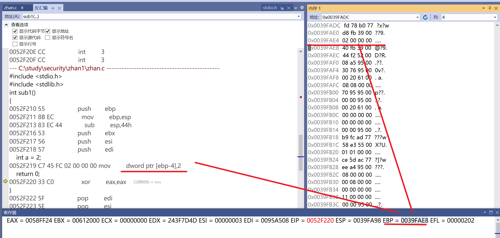

# 逆向工程实验一

**注意：本实验中因为多次进行调试执行，因此在截图过程中相同函数的地址可能会存在不同，但是含义是相同的**

## 实验步骤

**1. 在vs中建立工程，修改编译选项，只保留 /ZI （调试）和pdb文件路径两个选项，增加禁用安全检查选项（/GS-)。**


**2. 编译多个函数调用的示例代码。**

```c
#include <stdio.h>
#include <stdlib.h>
int sub1()
{
	int a = 2;
	return 0;
}

int sub3()
{
	int temp; //未赋初值的局部变量
	printf("%d", temp);
	return temp;
}

int sub2(int a, int b)
{
	int x = a + b + sub1(); //在sub2()中调用sub1()
	sub3();
	return x;
}

int main()
{
	int m = sub2(1, 2);
	return m;
}
```

**3. 下断点调试运行，观察反汇编、寄存器、内存等几个调试时的信息。**

- 在main函数中调用sub2()函数处设置断点


- main函数调用sub2函数的反汇编过程

```c
// 进入该函数前各个寄存器里的值
EAX = 0036FF34 EBX = 010F0000 ECX = 00000000 EDX = 9E1E1B93 ESI = 016F7590 EDI = 016FA3F8 EIP = 0030F279 ESP = 012FF744 EBP = 012FF794 EFL = 00000206 
	
	int m = sub2(1, 2);
0030F279 6A 02                push        2  //将参数2压入栈
0030F27B 6A 01                push        1  //将参数1压入栈
0030F27D E8 1C C8 FF FF       call        _sub2 (030BA9Eh) //调用函数sub2  
0030F282 83 C4 08             add         esp,8  
0030F285 89 45 FC             mov         dword ptr [m],eax  
	return m;
0030F288 8B 45 FC             mov         eax,dword ptr [m]  
}
```


- sub2()的反汇编过程

```c
//进入该函数时各个寄存器的值
EAX = 0036FF34 EBX = 010F0000 ECX = 00000000 EDX = 9E1E1B93 ESI = 016F7590 EDI = 016FA3F8 EIP = 0030F310 ESP = 012FF738 EBP = 012FF794 EFL = 00000206 
    
int sub2(int a, int b)
{
0030F310 55                   push        ebp  //在函数开始的时候将EBP压入栈中
0030F311 8B EC                mov         ebp,esp //将ESP的值赋给EBP ESP=012FF734 EBP=012FF734
0030F313 83 EC 44             sub         esp,44h  
0030F316 53                   push        ebx  
0030F317 56                   push        esi  
0030F318 57                   push        edi //将EBX,ESI,EDI压栈 ESP = ESP - 4*3
	int x = a + b + sub1(); 
0030F319 8B 75 08             mov         esi,dword ptr [ebp+8] //将ebp+8位置中的值赋给esi
0030F31C 03 75 0C             add         esi,dword ptr [ebp+0Ch] //将ebp+0Ch中的值与esi的值相加后存入esi中 
0030F31F E8 FE A7 FF FF       call        _sub1 (0309B22h)  //调用函数sub1()
0030F324 03 F0                add         esi,eax  
0030F326 89 75 FC             mov         dword ptr [ebp-4],esi  
	sub3();
0030F329 E8 54 A7 FF FF       call        _sub3 (0309A82h)  //调用函数sub3()
	return x;
0030F32E 8B 45 FC             mov         eax,dword ptr [ebp-4]  
}
```

- 执行了push ebp后，esp指向栈顶，后将ebp的值存放在这个位置，随后mov ebp,esp则是让ebp指向esp原来的位置，而esp随后执行sub esp 44h


- 准备调用sub1()，EIP中存的值是要调用的sub1()的地址


- sub1()的反汇编过程

```c
//进入该函数时各寄存器的值
EAX = 0036FF34 EBX = 010F0000 ECX = 00000000 EDX = 9E1E1B93 ESI = 00000003 EDI = 016FA3F8 EIP = 0030F2F0 ESP = 012FF6E0 EBP = 012FF734 EFL = 00000206 

int sub1()
{
0030F2F0 55                   push        ebp  //在函数开始的时候将EBP压入栈中
0030F2F1 8B EC                mov         ebp,esp  //将ESP的值赋给EBP ESP = 012FF6DC EBP = 012FF6DC
0030F2F3 83 EC 44             sub         esp,44h  
0030F2F6 53                   push        ebx  
0030F2F7 56                   push        esi  
0030F2F8 57                   push        edi  
//将EBX,ESI,EDI压栈 ESP = ESP - 4*3    
	int a = 2;
0030F2F9 C7 45 FC 02 00 00 00 mov         dword ptr [ebp-4],2  
	return 0;
0030F300 33 C0                xor         eax,eax  
}
```

- sub1()return 0之前的内存变换：将2移入ebp-4指向的地址


- sub1() return0时内存的变化：eax与自身进行异或，eax的值存放的为0，存放的是return的值


- 进行pop操作，pop操作仅仅只是将esp的指针向着ebp移动，并没有删除原先该位置的数据，因此只是esp指针的移动

```C
0030F302 5F                   pop         edi  
0030F303 5E                   pop         esi  
0030F304 5B                   pop         ebx  
0030F305 8B E5                mov         esp,ebp  //让esp指向ebp指向的位置 ESP = 012FF6DC EBP = 012FF6DC
0030F307 5D                   pop         ebp  //ESP = 012FF6E0 EBP = 012FF734 EBP指回最初调用sub2函数时的EBP位置，这个位置被存放在012FF6DC中
0030F308 C3                   ret  
```


- 回到sub2()函数

```c
0030F324 03 F0                add         esi,eax  //将eax的值，即sub1函数的返回值与esi的值相加并存放在esi中
0030F326 89 75 FC             mov         dword ptr [ebp-4],esi  //将esi的值存放在ebp-4的位置处
	sub3();
0030F329 E8 54 A7 FF FF       call        00309A82  //调用sub3函数
	return x;
0030F32E 8B 45 FC             mov         eax,dword ptr [ebp-4]
```

- 将esi的值存放在ebp-4处


- 调用函数sub3()，EIP中存的值是要调用的sub3()的地址


- sub3的反汇编过程

```C
//进入该函数时各寄存器的值
EAX = 00000000 EBX = 010F0000 ECX = 00000000 EDX = 9E1E1B93 ESI = 00000003 EDI = 016FA3F8 EIP = 0030F340 ESP = 012FF6E0 EBP = 012FF734 EFL = 00000206 
    
int sub3()
{
0030F340 55                   push        ebp  //在函数开始的时候将EBP压入栈中
0030F341 8B EC                mov         ebp,esp  //将ESP的值赋给EBP 
0030F343 83 EC 44             sub         esp,44h  
0030F346 53                   push        ebx  
0030F347 56                   push        esi  
0030F348 57                   push        edi  
//将EBX,ESI,EDI压栈 ESP = ESP - 4*3    
	int temp;
	printf("%d", temp);
0030F349 8B 45 FC             mov         eax,dword ptr [ebp-4]  //将ebp-4位置的值赋给eax
0030F34C 50                   push        eax  //将EAX的值压入栈中
0030F34D 68 50 2E 36 00       push        362E50h  
0030F352 E8 9F A6 FF FF       call        003099F6  
0030F357 83 C4 08             add         esp,8  
	return temp;
0030F35A 8B 45 FC             mov         eax,dword ptr [ebp-4]  
}
```

- sub3()中有一个没有赋予初值的局部变量temp，在反汇编过程中`mov eax,dword ptr[ebp-4]`便是将ebp-4位置的值赋给eax，实际上就是使得这个未赋初值的变量的值为ebp-4位置的值，而在调用sub1的时候，ebp-4的值为2，因为pop过程只是指针的移动而不是数值的清除，于是这个2被保存下来了，刚好赋给temp


- 回到main函数的反汇编过程

```C
	int m = sub2(1, 2);
0052F1E9 6A 02                push        2  
0052F1EB 6A 01                push        1  
0052F1ED E8 A2 C8 FF FF       call        0052BA94  
0052F1F2 83 C4 08             add         esp,8  
0052F1F5 89 45 FC             mov         dword ptr [ebp-4],eax  
	return m;
0052F1F8 8B 45 FC             mov         eax,dword ptr [ebp-4]  
}
0052F1FB 5F                   pop         edi  
0052F1FC 5E                   pop         esi  
0052F1FD 5B                   pop         ebx  
0052F1FE 8B E5                mov         esp,ebp  
0052F200 5D                   pop         ebp  
0052F201 C3                   ret  
```

- 完成push1和2操作后内存的变化


4. **分析函数调用过程中栈的变化。解释什么是栈帧？ebp寄存器在函数调用过程中的变化过程，ebp寄存器的作用。**

- 进入main函数

```C
push ebp  //保存父栈的栈底
mov ebp,esp  //将esp赋值给ebp，作为当前函数新的栈底
sub esp,44h  //esp移动，开辟栈帧，即开启过程活动记录，是编译器用来实现过程/函数调用的一种数据结构
```


- 调用sub2函数

```c
0030F310 55                   push        ebp  //保存main函数的栈底
0030F311 8B EC                mov         ebp,esp //将ESP的值赋给EBP 作为当前函数sub2新的栈底
0030F313 83 EC 44             sub         esp,44h  
```


- 当要跳出sub2进入sub1时，要对栈帧进行销毁
- pop表示弹出，弹出后会将值赋给寄存器，然后将edi,esi,ebx三个寄存器pop出栈，再根据记录的call指令的下一条指令的地址找到父函数，回收空间，完成整个函数调用的过程

```c
0052F24C 5F                   pop         edi  
0052F24D 5E                   pop         esi  
0052F24E 5B                   pop         ebx  
0052F24F 8B E5                mov         esp,ebp  
0052F251 5D                   pop         ebp  
0052F252 C3                   ret  
```

- 调用sub1函数

```c
0030F2F0 55                   push        ebp  //保存sub2函数的栈底
0030F2F1 8B EC                mov         ebp,esp  //将ESP的值赋给EBP，作为当前函数sub1新的栈底
0030F2F3 83 EC 44             sub         esp,44h  
```

**5. 函数局部变量和参数的保存位置、访问位置是什么？**

- 函数的局部变量和参数保存位置：栈帧中
- 访问方式：通过ebp的偏移进行访问
- 如下图，将变量的值存在ebp-4处，之后访问也是访问ebp-4



**6. 多层函数调用，栈的变化情况，解释未赋初始值的局部变量的值是如何形成的**

- 函数调用和返回过程中：①参数压栈传递，且是从右往左依次压栈。 ②ebp总是指向当前栈帧的栈底。 ③返回值通过eax寄存器进行传递

- 以下列代码为例

```C
#include <stdio.h>
#include <stdlib.h>
int sub1()
{
	int a = 2;
	return 0;
}

int sub3()
{
	int temp; //未赋初值的局部变量
	printf("%d", temp);
	return temp;
}

int sub2(int a, int b)
{
	int x = a + b + sub1(); //在sub2()中调用sub1()
	sub3();
	return x;
}

int main()
{
	int m = sub2(1, 2);
	return m;
}
```

- 在sub2中先调用sub1再调用sub3，而sub3中的temp没有赋予初始值，但是执行程序后却发现printf出的值为2


- sub1中把2存在了0x0098F7B8中


- 进入sub3后，可以看到eax中存放的值在0x0098F7B8中，也就是sub1的局部变量a=2


- 由此便可以知道未赋初值的局部变量的值是怎么产生的：pop操作并不是将数据从内存中删除，而是栈指针的移动操作，因此一些函数的返回值会留存在内存中，当未赋予初值的变量与该地址重合时，会让为赋初值的局部变量有值，同理也可以推出栈帧的结构是一样的。

